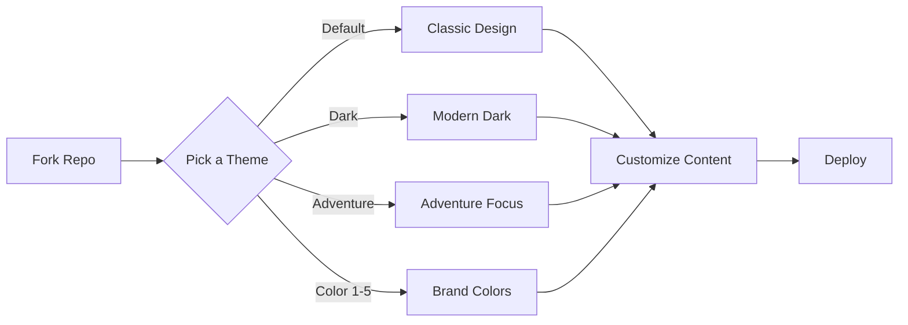

<div align="center">

# ✈️ Travel & Tour Booking HTML Template

*Professional travel booking website with multiple color themes, responsive design, and booking system*

[](https://vercel.com/new/clone?repository-url=https://github.com/MrShadowRIFAT/WSRPQTD-Travel_Tour_Booking_HTML_Template)


**Take travelers on a journey. Beautiful. Responsive. Booking-ready.**

</div>

---

## ✨ Why This Project

Launch a stunning travel & tour booking website in minutes. Multiple professionally-designed themes, color variants, and a complete booking system. Perfect for travel agencies, tour operators, and adventure businesses.

---

## 🔥 Features

✈️ **Travel Focused Design** – Built for tour operators & agencies  
🎨 **7+ Color Themes** – Choose your brand identity  
📱 **Fully Responsive** – Mobile, tablet, desktop perfect  
🗓️ **Booking System** – Ready-to-integrate booking forms  
🌍 **Destination Showcase** – Tour & package display  
💰 **Pricing Tables** – Clear pricing & packages  
⭐ **Customer Reviews** – Testimonials section  
🚀 **High Performance** – Optimized assets & loading  

---

## 🚀 Quick Setup

### 1️⃣ Fork Repository
```bash
# Click Fork button on GitHub
# Your own copy is ready
```

### 2️⃣ Deploy with Vercel
Press the button above → Connect GitHub → Deploy (instant!)

### 3️⃣ Local Development
```bash
git clone https://github.com/YOUR_USERNAME/WSRPQTD-Travel_Tour_Booking_HTML_Template.git
cd WSRPQTD-Travel_Tour_Booking_HTML_Template
python -m http.server 8000
# Open http://localhost:8000
```

---

## 📁 Theme Variants

| Theme | Style | Best For |
|-------|-------|----------|
| **Default** | Classic & Clean | General Travel |
| **Dark** | Modern & Bold | Premium Agencies |
| **AdventureTour** | Adventure Focused | Adventure Tours |
| **Color 1** | Vibrant Blue | Water Tours |
| **Color 2** | Warm Orange | Desert Tours |
| **Color 3** | Cool Green | Nature Tours |
| **Color 4** | Purple Accent | Luxury Tours |
| **Color 5** | Red Energy | Action Tours |

---

## 📂 Project Structure

| Folder | Purpose |
|--------|---------|
| `default/` | Standard light theme |
| `dark/` | Dark professional theme |
| `AdventureTour/` | Adventure-specific design |
| `color1-5/` | Branded color variants |
| Assets | CSS, JS, images (per theme) |

---

## 🧠 How It Works



---

## 🛠️ Tech Stack

<div align="center">


</div>

**HTML5** • **CSS3** • **JavaScript** • **Bootstrap** • **Responsive Design**

---

## 📝 Key Sections

**Hero** – Eye-catching banner with CTA  
**Destinations** – Featured tour packages  
**Why Choose Us** – USP highlights  
**Popular Tours** – Top package showcase  
**Pricing** – Clear pricing tables  
**Testimonials** – Customer reviews  
**Booking Form** – Lead capture  
**Footer** – Contact & social links  

---

## 🎯 Features Breakdown

✨ **Destination Cards** – Beautiful tour displays  
📅 **Date Pickers** – Booking date selection  
💵 **Pricing Display** – Transparent pricing  
🗺️ **Location Maps** – Destination showcases  
📸 **Image Galleries** – Photo carousels  
💬 **Review System** – Customer testimonials  
👥 **Team Section** – Guide introductions  
📞 **Contact Forms** – Direct communication  

---

## 📦 Customization

1. **Pick Theme** – Choose from 7+ color variants
2. **Edit Content** – Update destinations & packages
3. **Replace Images** – Add your travel photos
4. **Update Branding** – Customize colors & fonts
5. **Add Contact Info** – Your agency details
6. **Connect Booking** – Integrate with booking system

---

## 🎨 Theme Customization

Each theme includes:
- Complete HTML pages
- Custom CSS color schemes
- Theme-specific imagery
- Consistent branding

Change themes by:
1. Selecting your preferred folder
2. Customizing HTML files
3. Updating color values in CSS
4. Replacing images

---

## 💼 Travel Business Ready

**Tour Packages** – Showcase offerings  
**Group Bookings** – Handle volume requests  
**Seasonal Tours** – Update seasonally  
**Package Deals** – Create combinations  
**Add-on Services** – Extra offerings  
**Insurance Info** – Travel insurance  
**Terms & Conditions** – Legal clarity  

---

## 📊 GitHub Stats

<div align="center">


</div>

---

## 🌍 Deployment

| Platform | Deploy Time | Cost |
|----------|-------------|------|
| **Vercel** | < 1 min | Free |
| **GitHub Pages** | 2 mins | Free |
| **Netlify** | 2 mins | Free |
| **Web Hosting** | 5 mins | Paid |

---

## 📱 Mobile Optimization

✅ Touch-friendly navigation  
✅ Optimized images  
✅ Fast loading times  
✅ Mobile-first design  
✅ Responsive layouts  
✅ Easy form input  

---

## 👨‍💼 Author

**MrShadowRIFAT** | [🔗 rifat.website](https://rifat.website) | [📧 noreply@rifat.website](mailto:noreply@rifat.website)

---

<div align="center">

**[⭐ Star This Repo](#)** • **[🐛 Report Issue](#)** • **[💡 Suggest Feature](#)**

Made with ❤️ for travel businesses

</div>
